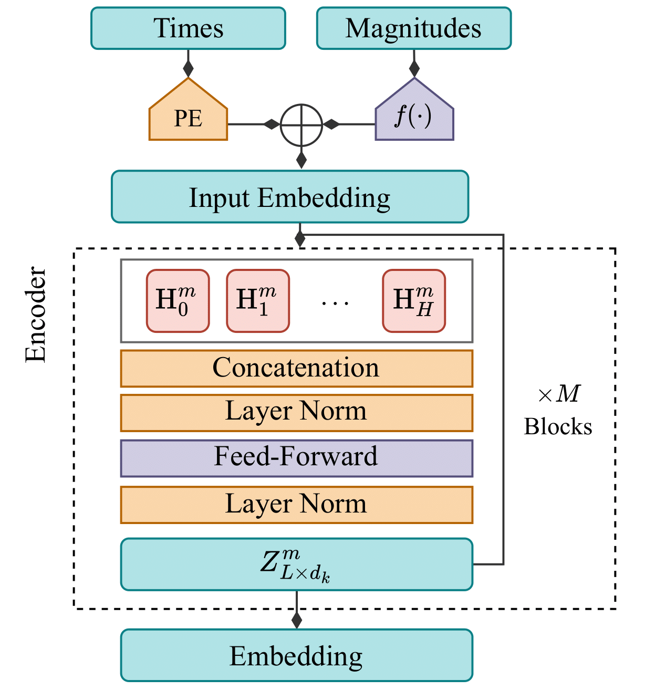
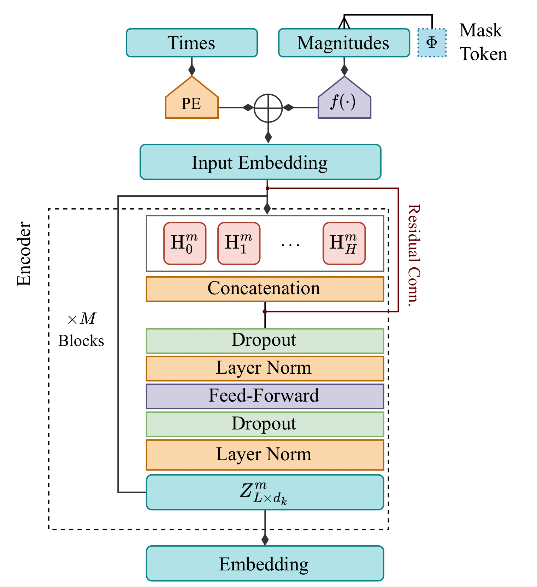
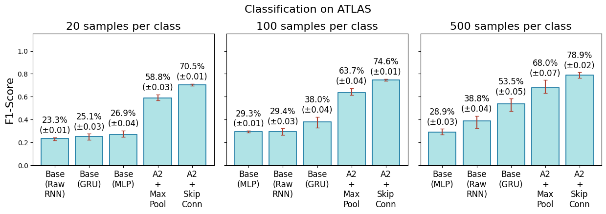

# ASTROMER 2: Generalizing Across Astronomical Surveys

[](https://doi.org/10.5281/zenodo.18207945)
[](https://arxiv.org/abs/2502.02717)
[](LICENSE)

**Astromer 2** is a foundational model for light curve analysis, designed to extract robust embeddings from astronomical time-series data using self-supervised learning. Building upon the original Astromer architecture, this version introduces significant enhancements in input representation, encoder depth, and pretraining objectives, enabling superior generalization across diverse surveys like MACHO and ATLAS.

<p align="center">
  
  
</p>
<p align="center">
  <em>Figure: Comparison of Astromer 1 (Left) and Astromer 2 (Right) architectures.</em>
</p>


## 🚀 Key Features

* **Transformer-based Encoder:** Utilizes a self-attention mechanism to capture long-range dependencies in irregular time-series.
* **Self-Supervised Pretraining:** Trained on 1.5 million unlabeled light curves from the MACHO survey.
* **Enhanced Architecture (v2):**
    * **Trainable Mask Token:** Replaces zero-masking to better handle missing data.
    * **Deeper Network:** Increased capacity with 6 attention blocks.
    * **Uncertainty-weighted Loss:** Pretraining objective accounts for observational errors.
* **Few-Shot Learning:** Optimized for high performance even in data-scarce regimes (e.g., 20 samples per class).

## 📊 Results: Generalization & Ablation

Astromer 2 demonstrates state-of-the-art performance in classifying variable stars, particularly when applied to datasets with different distributions than the pretraining data.

### Ablation Study on ATLAS
We evaluated the impact of the Astromer embeddings compared to baseline architectures (Raw RNN, GRU, MLP) on the ATLAS dataset. The results highlight the robustness of our pre-trained representations.


*> Note: This figure demonstrates the F1-score comparison on the ATLAS dataset.*

**Key Findings:**
* **Generalization:** Astromer 2 achieves a **15% improvement** in F1 score on the ATLAS dataset compared to prior models.
* **Data Efficiency:** The model's performance with only **20 samples per class (SPC)** surpasses results previously obtained with 500 SPC using baseline methods.
* **Embedding Quality:** The ablation study confirms that the improvements are fundamentally driven by the Astromer input embedding strategy (magnitude projection + positional encoding), which significantly lowers the sample complexity required for convergence compared to raw inputs.

## 🛠 Installation

Clone the repository and install the dependencies:

```bash
git clone [https://github.com/astromer-science/astromer.git](https://github.com/astromer-science/astromer.git)
cd astromer
pip install -r requirements.txt

```

## 📘 Notebooks (`context/presentation/notebooks/`)

> **⚠️ Prerequisite:** To run these notebooks, you must possess the **pre-trained model weights** and the **experiment results**. These files are strictly required to reproduce the figures and are available in our permanent archive on **Zenodo**:
>
> [](https://doi.org/10.5281/zenodo.18207945)
>
> *Please download and place the artifacts in the corresponding directories before running the analysis.*

These notebooks are primarily used for **visualization and analysis** of post-training results. Each one generally corresponds to a specific section or figure in the paper.

* **`results.ipynb`**
    * **Purpose:** The main notebook for aggregating metrics. It processes the training output logs and generates summary tables.
    * **Relation to Paper:** Likely used to generate the numerical values cited in the Results section.

* **`embedding_visualization.ipynb`**
    * **Purpose:** Loads pre-trained model weights and the test dataset to generate 2D projections using t-SNE.
    * **Relation to Paper:** Generates **Figures 10 and 11** (t-SNE visualization of embeddings on Alcock and ATLAS).

* **`clasification_weights.ipynb`**
    * **Purpose:** Analyzes the $\gamma$ (gamma) weights learned by the classifier to determine which encoder blocks are most important.
    * **Relation to Paper:** Generates **Figure 9** (Gamma weights per layer).

* **`astromer_vs_classical.ipynb`**
    * **Purpose:** Compares the performance of Astromer 2 against baselines (Raw RNN, Supervised GRU, MLP).
    * **Relation to Paper:** Generates **Figure 12** (Ablation Study).

* **`reconstruction_lc.ipynb`**
    * **Purpose:** Visualizes how the model reconstructs masked light curves and displays the model's attention.
    * **Relation to Paper:** Generates **Figures 7 and 8** (Attention maps on light curves) and the Appendix B figures.

* **`confusion_matrices.ipynb`**
    * **Purpose:** Takes classifier predictions and generates confusion matrices to evaluate per-class errors.
    * **Relation to Paper:** Generates **Figures 13 and 14** (Confusion matrices for Alcock and ATLAS).

* **`data.ipynb`**
    * **Purpose:** Performs exploratory analysis of raw data (magnitude distribution, time cadence).
    * **Relation to Paper:** Generates **Figures 2 and 3** (Magnitude and $\Delta t$ distributions).

* **`create_records.ipynb`**
    * **Purpose:** Interactive version for debugging TFRecord creation. Useful for verifying that data is formatted correctly before launching the bulk script.

---

### 🛠 Scripts (`context/presentation/scripts/`)

These scripts are designed for **infrastructure, batch processing, and distributed training** tasks. They are typically executed from the terminal.

* **`create_records.py`**
* **Function:** Critical ETL (Extract, Transform, Load) script. Reads raw data (e.g., Parquet or CSV files from MACHO/ATLAS) and converts them into **TFRecord** format.
* **Importance:** Astromer trains using TFRecords for maximum I/O efficiency. This script must be run before any training.


* **`to_parquet.py`**
* **Function:** Converts database dumps or text files (original survey formats) into **Parquet** format, which is faster for Pandas/Python to read. A precursor step to `create_records.py`.


* **`pretrain_ckpt.py`**
* **Function:** Manages pre-training checkpoints. Can be used to clean old checkpoints, convert weights from one format to another, or prepare weights for *finetuning*.


* **`distributed/disttrain.py` & `distkeras.py**`
* **Function:** Scripts configured to run training across multiple GPUs using `tf.distribute.MirroredStrategy`.
* **Usage:** Used when training the base model on the full MACHO dataset (1.5 million light curves), as a single GPU is insufficient.


---

### 🚀 Key Pipelines (`context/presentation/pipelines/`)

This directory contains the core execution flows for the model.

* **`pipeline_0/`** (Main Experiment Pipeline)
    * **Purpose:** Contains the end-to-end workflow presented in the original manuscript. It handles the complete lifecycle of Astromer 2.
    * **Key Scripts:**
        * `pretrain.py`: Executes the self-supervised pretraining on MACHO data.
        * `finetune.py`: Adapts the pretrained model to labeled datasets.
        * `classify.py`: Runs the downstream classification tasks.

* **`updates2025/`** (Referee Response & Post-Experiments)
    * **Purpose:** Contains specific scripts developed to address referee comments and conduct additional ablation studies.
    * **Key Scripts:**
        * `train.py`: A consolidated script used to run the ablation baselines (e.g., Raw RNN, GRU) and generate the comparison metrics requested during the review process.

## 💻 Usage

### Pretraining

To pretrain the model from scratch using the low-level API:

```python
from src.models.astromer_1 import get_ASTROMER
from tensorflow.keras.optimizers import Adam

# Build the model (Astromer 2 configuration)
model = get_ASTROMER(num_layers=6, 
                     num_heads=4, 
                     head_dim=64, 
                     window_size=200,
                     trainable_mask=True)

# Compile with custom optimizer
optimizer = Adam(learning_rate=1e-3)
model.compile(optimizer=optimizer)

# Train on your dataset (tf.data.Dataset)
model.fit(train_dataset, epochs=100)

```

### Finetuning (Classification)

To load weights and fine-tune for classification:

```python
from presentation.pipelines.steps import model_design
from presentation.pipelines.updates2025 import classifiers
from tensorflow.keras.optimizers import Adam
from tensorflow.keras.losses import CategoricalCrossentropy

# 1. Load Pretrained Model & Config
pt_path = './weights/astromer_v2/macho'
pt_model, pt_config = model_design.load_pt_model(pt_path, optimizer=None)

# 2. Build Classifier Head (e.g., Skip-Connection Average)
pt_config['num_cls'] = 7  # Number of classes
classifier = classifiers.skip_avg_clf(pt_model, pt_config)

# 3. Compile
classifier.compile(optimizer=Adam(learning_rate=1e-3),
                   loss=CategoricalCrossentropy(from_logits=True),
                   metrics=['accuracy'])

# 4. Train
classifier.fit(train_dataset, 
               validation_data=val_dataset,
               epochs=50)

```

## 📚 Data Availability

* **Source Code:** Available in this repository.
* **Pre-trained Weights:** Archived on [Zenodo](https://doi.org/10.5281/zenodo.18207945).
* **Documentation:** Visit our [Project Website](https://www.stellardnn.org/projects/astromer/index.html).

## 📝 Citation

If you use Astromer 2 in your research, please cite our paper:

```bibtex
@article{astromer2,
  author = {Donoso-Oliva, C. and Becker, I. and Protopapas, P. and Cabrera-Vives, G. and C\'adiz-Leyton, M. and Moreno-Cartagena, D.},
  title = {Generalizing across astronomical surveys: Few-shot light curve classification with Astromer 2},
  journal = {Astronomy \& Astrophysics},
  year = {2026},
  note = {In press}
}

```

## 🙏 Acknowledgements

The authors acknowledge support from the National Agency for Research and Development (ANID) grants: **FONDECYT Regular 1231877 (C.D.O., G.C.V., M.C.L., D.M.C.)**. G.C.V. acknowledges support from the Millennium Science Initiative through the **Millennium Institute of Astrophysics (MAS) AIM23-0001**. C.D.O. acknowledges support from the **Millennium Nucleus on Young Exoplanets and their Moons (YEMS) through the Millennium Science Initiative Program (NCN2024_001)**. This work was also supported by the Center for Data and Artificial Intelligence at the Universidad de Concepción. We thank the MACHO and ATLAS collaborations for making their data publicly available.
